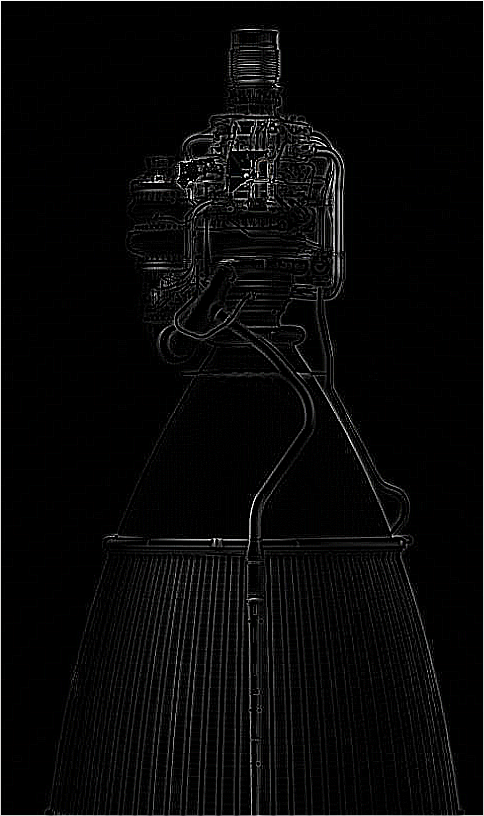

# This is my first repo

该程序可以将图片中的轮廓提取出来，并转化为黑白图片，同时支持图片格式转换功能。

## 使用方法

在命令行中输入以下命令：

```bash
python picture_form_converter.py "C:\Users\jiaid\Pictures\Screenshots\屏幕截图 2024-09-04 165419.png" "C:\Users\jiaid\Desktop" --name "movhhh.bmp" --style "black"
```
<br>


